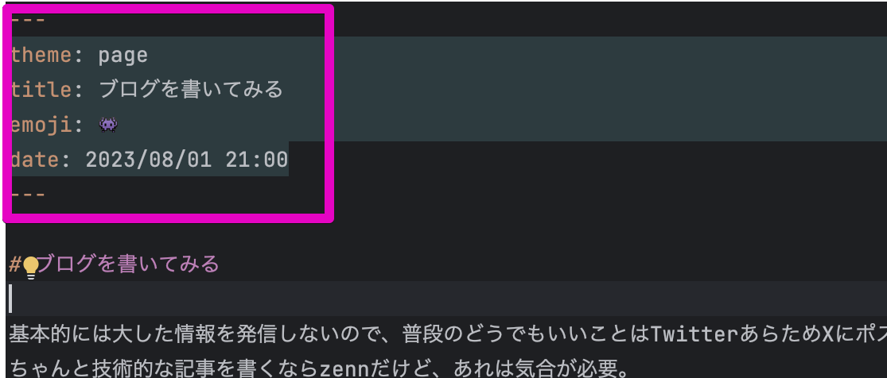

基本的には大した情報を発信しないので、普段のどうでもいいことはTwitterあらためXにポストしてる。  
ちゃんと技術的な記事を書くならzennだけど、あれは気合が必要。

Xのアクセス制限の際に考えたこととして、今更ながら何かしらブログ用の媒体は持っておいたほうがよさそうだなと。  

## ブログサービスを探してみる

昔はいろんなサービス使ったり、WordPressなりMovableTypeなりいろいろやってみたけど、ブログって未だに「コレ」ってサービスがないよね。

- Markdownで書きたい
- 独自ドメインは使いたい
- そこそこカスタマイズしたい（いじりたい）
- できれば無料がいい
- サーバーの管理とかはしたくない

っていうあたりに激マッチするサービスって特にないんだよなー的な。
技術記事全く関係ないフリーダムなZennなりQiitaなりが望むところなんだけど、そんなサービス知らんし。

## Nuxtでやってみた

で、最初はNuxt+(Vercel/Cloudflare/AWS)あたりでいろいろやってみて、  
**「時代はSSRというかServerSideComponentというかなんかそんな感じで爆速レンダリングだよね！！！」**  
みたいな感じでいろいろやってみたんだけど、単純にむずかった。

- Nuxt環境が整ってなさすぎて、ソース追っかけて自前で構築する必要がある場所がまだ多々ある
- Edge Function はじめて使ったけど微妙に制限きつくね？

ってあたりで、そんなに追っかけきれてはないんだけど、たかだかブログ用のチョロっとしたもの作りたいだけなのにドハマリしてしんどかったのでポイした。

## 最終的にVitePressで構築した

あとはNotionかな〜とか、はてなブログか・・・？とかいろいろ考えたけど、タイミングよく[VitePress](https://vitepress.dev/)が RCになった記事が流れてきたからRCで構築してみた。

SSGのほうがSSRより早いだろうし（だよね？）、GithubPageで無料でいけるし最高やん、という気持ちになった。

使い勝手ようわからんけど、まぁこれなら

- 無料（すごい）
- Markdownでかける（すごい）
- カスタマイズし放題（すごい）
- サービスが死ななそう
- 最悪Githubが滅んでもGitリソースは拾い上げれそう

ってあたりで今後30年くらいは維持できるんじゃないかなと。SDGs。

## VitePress使い勝手

まだ1記事目だし、そんなに使いこなせてないという前提で書き味をレビュー。

こんな感じでMarkdownの先頭にメタ情報を書く必要あるのが面倒くさい。  
`title` は1行目で使いまわしたい気がしつつ、とくに見当たらんから[VPDoc](https://github.com/vuejs/vitepress/blob/main/src/client/theme-default/components/VPDoc.vue)あたりを参考に自前のThemeを作るしかないかなぁ。

最初は「俺はデフォルトテーマなんかに頼らないぜ！自分でやるぜ！」って思ったものの、ちょっと手をだした感じ地味に面倒そうだったのと、デフォルトテーマが検索機能備えてたりして便利だったのでそのまま使うことにした。

画像のアップロードとか、このへんのメタ情報の入力周りとかは、普通のWebサービスのがいいよね。  
まぁ許容範囲だし大したことないから別にいいんだけど。